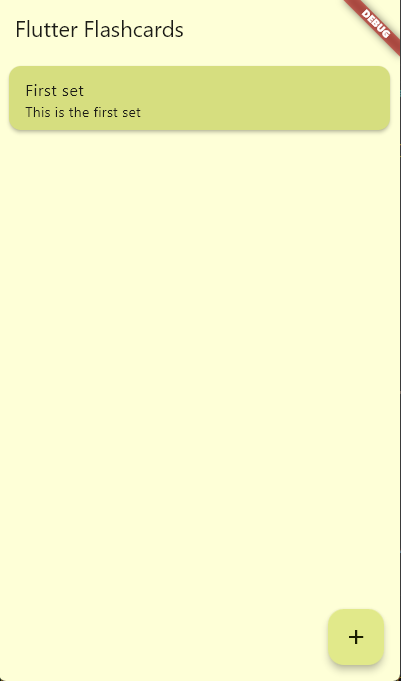
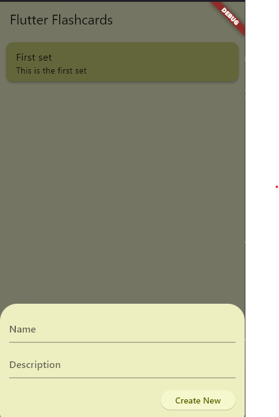
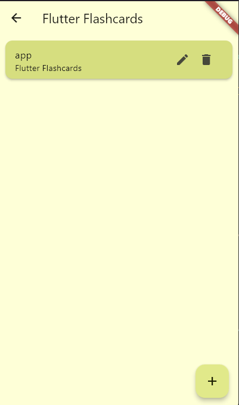
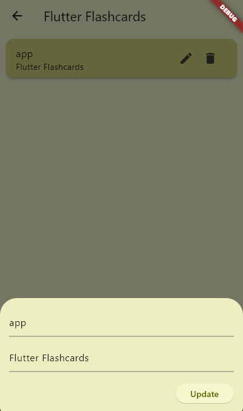
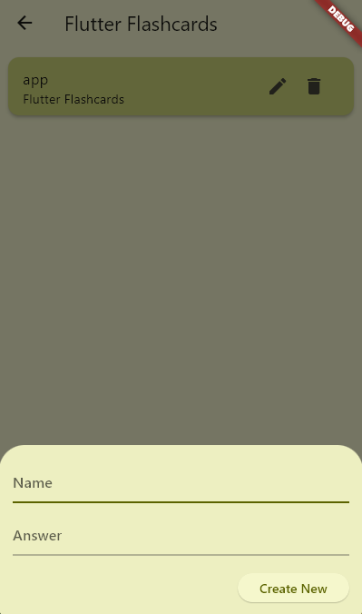

# Flutter Flashcards

A new Flutter project for managing and creating flashcards that can help with studying.
The app consists of sets that each have multiple cards. These sets can be practiced thorugh randomized questioning

This projects uses Flutter/Dart. Hive is used for storage.

## Getting Started

This project is a WIP (Work In Progress).

## Pictures
Here's some pictures about the app

The homepage:

Creating a set:

Cards:

Update cards:

Create cards:

## WIP

### Features to be added

- Upload JSON files to convert JSON to sets with cards

- Questioning system

